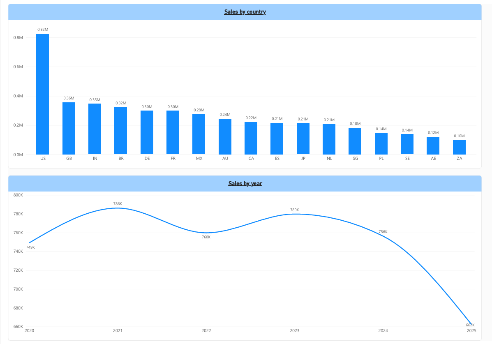
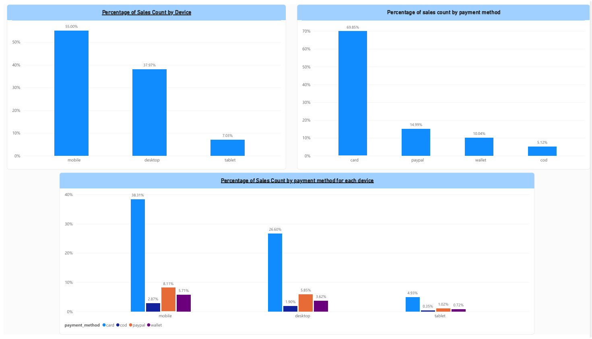
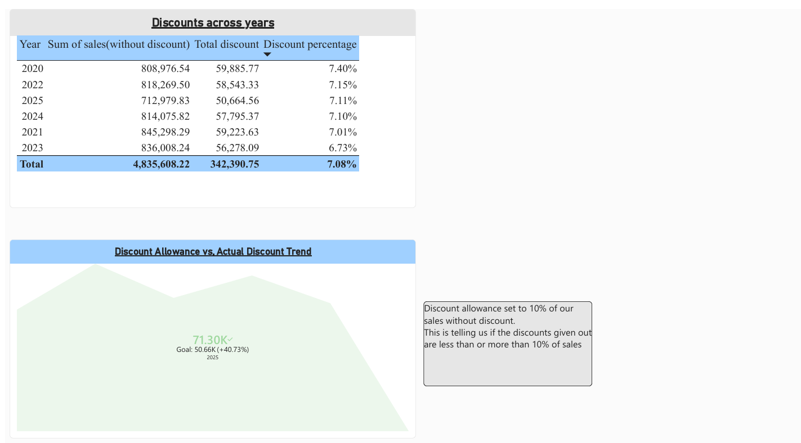
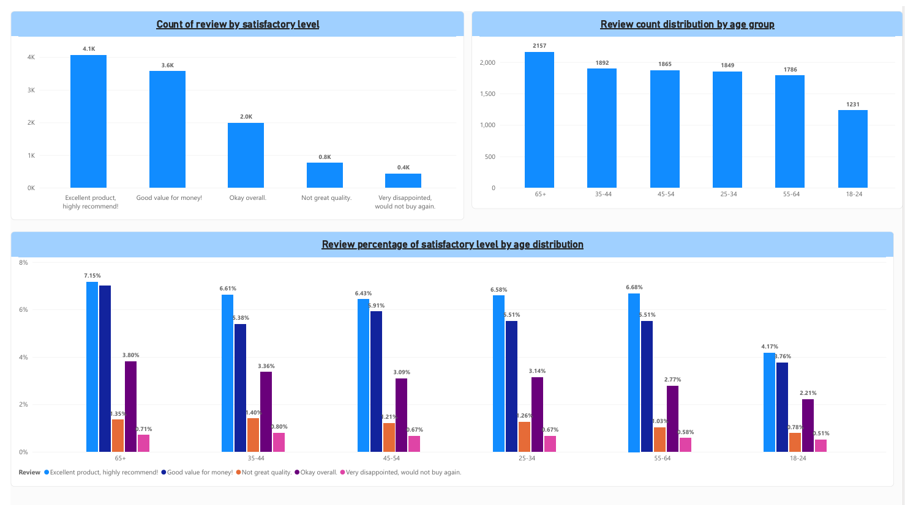
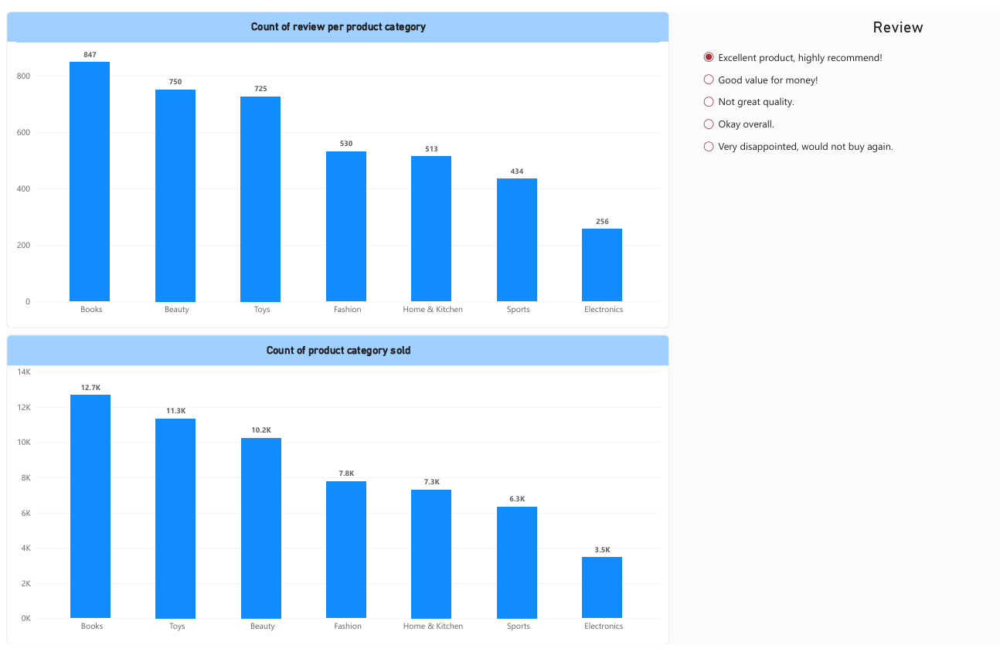
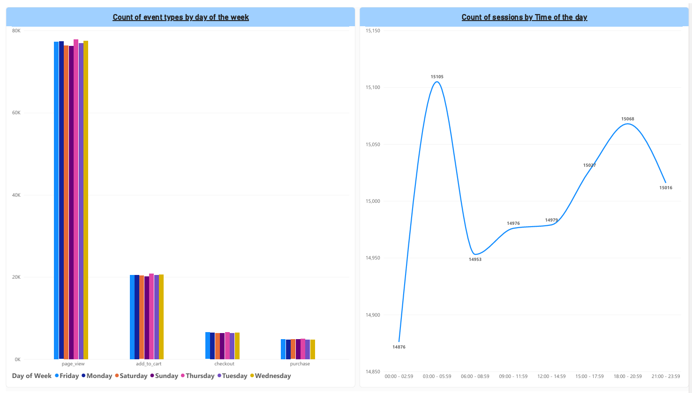

# Power BI Dashboard 

    This section is about the Power BI part of the project. It has the visuals taken from Power BI

These are my four fact tables and dimension tables linked to them.

    fact_clikcstream(dim_country, dim_customers, dim_device, dim_event, dim_product, dim_source, dim_date)
    fact_item_sales(dim_product)
    fact_review(dim_product, dim_date, dim_device, dim_country, dim_customer, dim_review, dim_source)
    fact_sales(dim_date, dim_device, dim_country, dim_source, dim_customer, dim_payment_method)

## Page Overview

## Page 1: Sales by Geography & Year
Shows where revenue comes from geographically and how overall sales have trended year over year, highlighting the US as the dominant market and a dip in the most recent year.

- **Sales by country**: total revenue by country, ranked highest to lowest.
- **Sales by year**: total sales trend from 2020–2025.

## Page 2: Device & Payment Method Breakdown
Examines how customers shop — which devices they use and how they pay — and how those two behaviors interact.

- **Percentage of Sales Count by Device**: share of orders placed on mobile, desktop, and tablet.
- **Percentage of Sales Count by Payment Method**: share of orders paid by card, PayPal, wallet, or COD.
- **Percentage of Sales Count by Payment Method for each Device**: cross-tab of preferred payment method per device type.

## Page 3: Discount Analysis
Tracks how much discount is actually being given out year over year against the 10% allowance target, to monitor discount discipline.

- **Discounts across years**: table of undiscounted sales, total discount given, and discount rate per year.
- **Discount Allowance vs. Actual Discount Trend**: gauge comparing actual discount total against the 10%-of-sales goal for the current year.

## Page 4: Customer Reviews & Satisfaction
Looks at how satisfied customers are overall and whether satisfaction differs across age groups.

- **Count of review by satisfactory level**: volume of reviews per sentiment category, from "Excellent" to "Very disappointed."
- **Review count distribution by age group**: number of reviews contributed by each customer age bracket.
- **Review percentage of satisfactory level by age distribution**: sentiment mix normalized within each age group, to compare satisfaction rates rather than raw counts.

## Page 5: Product Category Performance
Compares which categories sell the most units against which categories generate the most reviews, to spot mismatches between sales volume and customer engagement.

- **Count of review per product category**: number of reviews left, broken down by category.
- **Count of product category sold**: units sold per category.
- **Review (selector)**: slicer letting users filter the page by a specific satisfaction level.

## Page 6: Clickstream & Session Behavior
Explores on-site behavior — what actions customers take and when they're most active — independent of whether a purchase happened.

- **Count of event types by day of the week**: volume of page views, add-to-carts, checkouts, and purchases, split by day.
        Here we can see that the very little change shows a customer is likely to perform any action at any day of the week.
        The data skew happens at the event type(on page_view) level and not week day level because of the nature of our data since a customer must "view" a page before even thinking about buying.
- **Count of sessions by time of the day**: session volume across time-of-day buckets, showing peak browsing windows.

